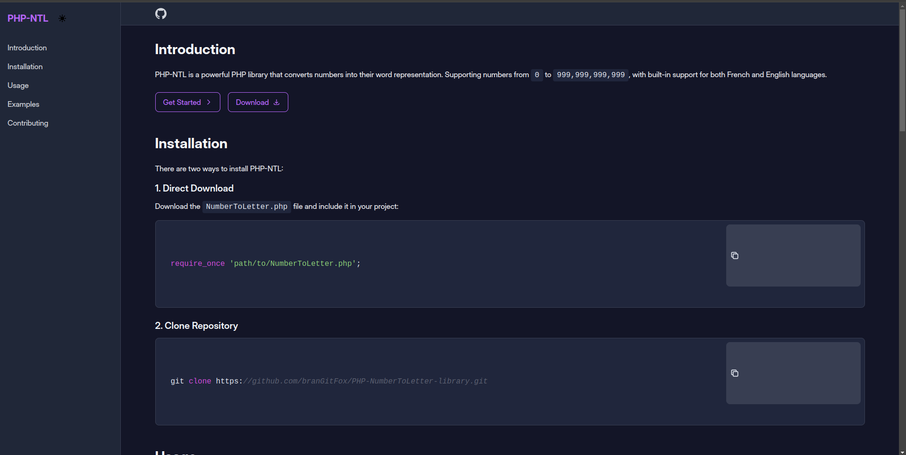

# NumberToLetter
PHP-NTL is a powerful PHP library that converts numbers into their word representation. Supporting numbers from `0` to `999,999,999,999`, with built-in support for both `French` and `English` languages.
## Website

