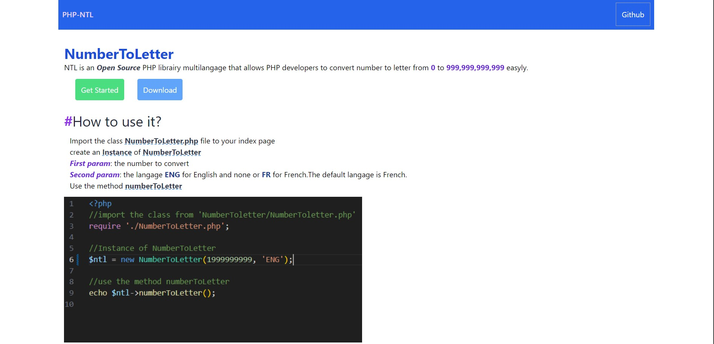
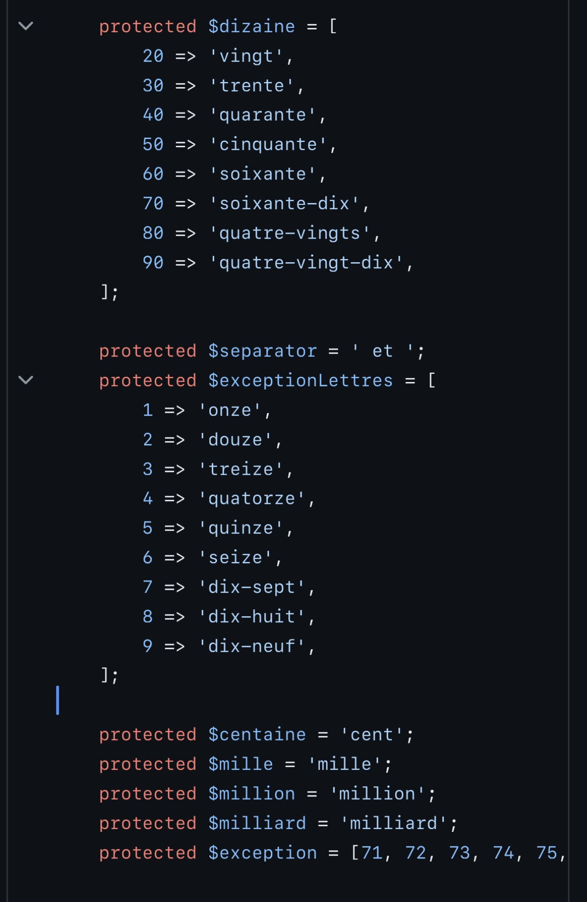
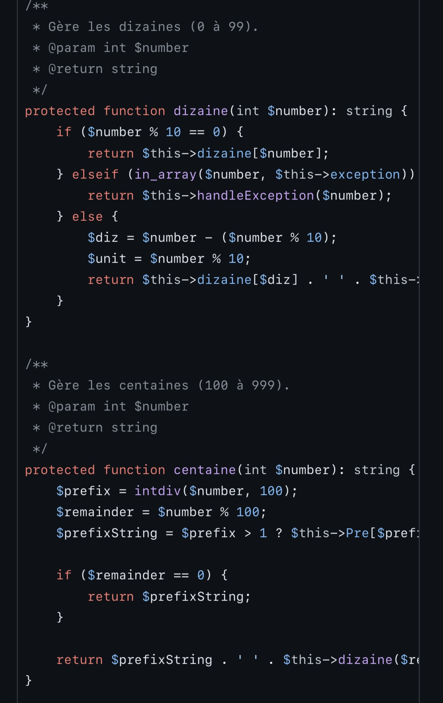
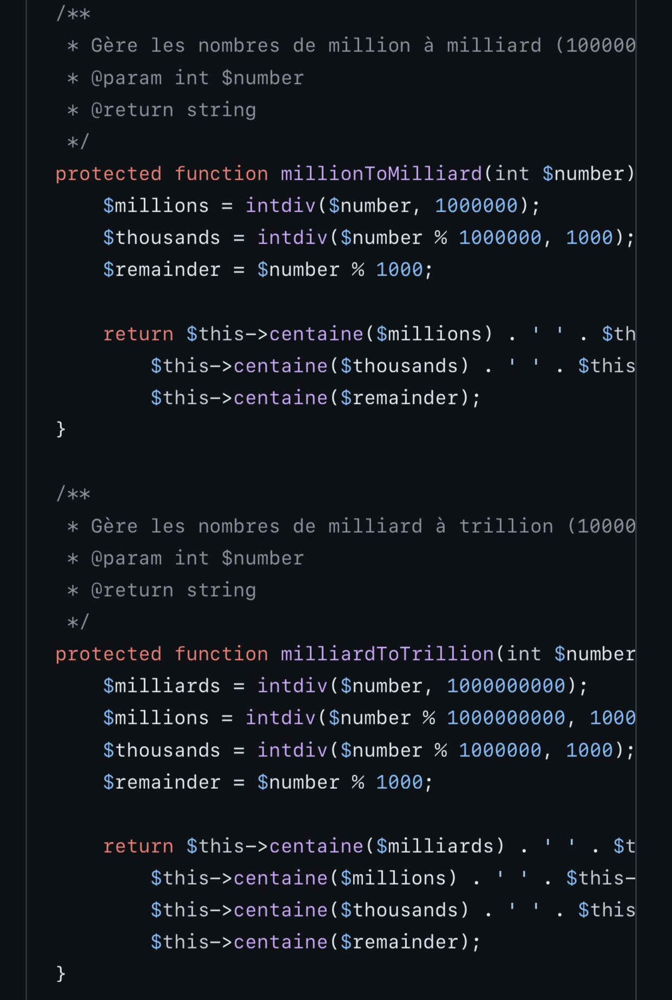
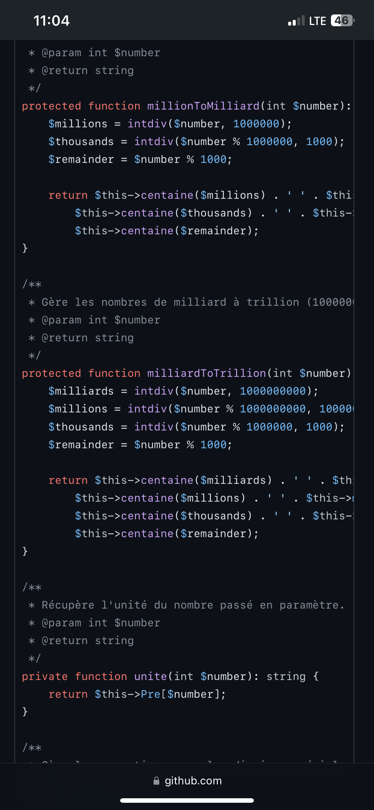

# NumberToLetter
A PHP library that allows PHP developer to convert a  `Number` from 0 to 999,999,999,999 to a  `letter String`.
you can get the documentation [here]()
## View

## Some Code Algorithms
### `Initializing dictionnary`

### `Handle number from 0 to 999`

### `1000 to 999,999,999`

# Choose Langage 
### `FR` for `French`
### `ENG` for ˋEnglish`

# Make many `Test`

